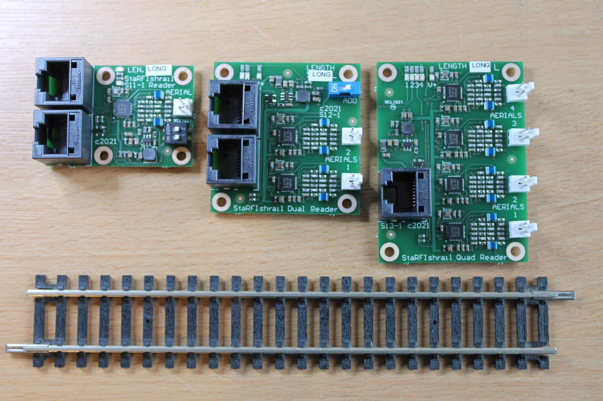

# StaRFIshrail RFID I2C Reader Arduino Library

This library was created by Alex Shepherd, based on the sample Arduino sketch provided by the late Martin Snashall. The identity of the original example sketch author is unknown, with the only hint being the initials "MGB" at the top of the sketch.

For more details, the original files received from Martin are in the library's **extras** folder.

Details about the StaRFIshrail Reader boards can be found on the website: [here].(https://www.starfishrail.co.uk/sfrconnect).

